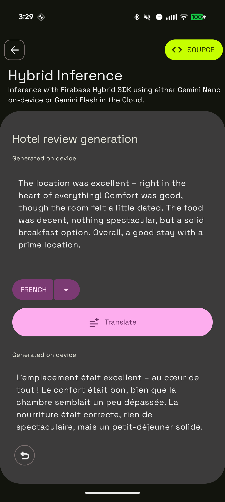

# Gemini Hybrid Sample

This sample is part of the [AI Sample Catalog](../../). To build and run this sample, you should clone the entire repository.

## Description

This sample demonstrates how to use the Firebase Hybrid SDK, utilizing both on-device (Gemini Nano via [ML Kit Prompt API](https://developers.google.com/ml-kit/genai/prompt/android)) and cloud-based models via the [Firebase AI Logic SDK](https://firebase.google.com/docs/ai-logic).

The sample lets users generate generic user reviews for a hotel based on a few selected topics. 

<div style="text-align: center;">

</div>

## How it works

Here is how the model is instantiated to leverage hybrid inference:
```kotlin
val model = Firebase.ai(backend = GenerativeBackend.googleAI())
                .generativeModel(
                    "gemini-2.5-flash-lite",
                    onDeviceConfig = OnDeviceConfig(mode = InferenceMode.PREFER_ON_DEVICE)
                )

val response = model.generateContent(prompt)
```

Read more about the [Firebase Hybrid SDK](https://firebase.google.com/docs/ai-logic/hybrid/android/get-started?api=dev) in the Firebase documentation.
