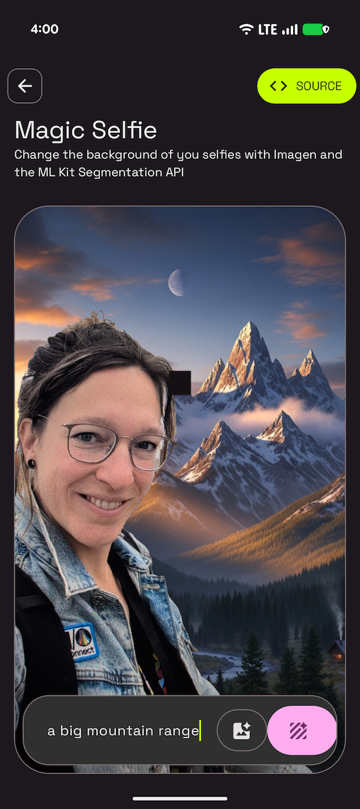

# Magic Selfie Sample

This sample is part of the [AI Sample Catalog](../../). To build and run this sample, you should clone the entire repository.

## Description

This sample demonstrates how to create a "magic selfie" by replacing the background of a user's photo with a generated image. It uses the Nano Banana 2 (`gemini-3.1-flash-image-preview`) model to perform semantic image editing, transforming the background based on a text prompt while preserving the subject.

<div style="text-align: center;">

</div>

## How it works

The application uses the Firebase AI SDK (see [How to run](../../#how-to-run)) for Android to interact with the Nano Banana 2 model. Unlike older approaches that require manual subject segmentation and image compositing, Nano Banana 2 can process a multimodal prompt (an image plus text) to modify the scene directly. The application sends the user's selfie and a prompt describing the desired background, and the model generates a new version of the image with the background replaced. The core logic for this process is in the [`MagicSelfieViewModel.kt`](./src/main/java/com/android/ai/samples/magicselfie/ui/MagicSelfieViewModel.kt) and [`MagicSelfieRepository.kt`](./src/main/java/com/android/ai/samples/magicselfie/data/MagicSelfieRepository.kt) files.

Here is the key snippet of code that calls the generative model from [`MagicSelfieRepository.kt`](./src/main/java/com/android/ai/samples/magicselfie/data/MagicSelfieRepository.kt):

```kotlin
suspend fun generateMagicSelfie(bitmap: Bitmap, prompt: String): Bitmap {
    val multimodalPrompt = content {
        image(bitmap)
        text("Change the background of this image to $prompt")
    }
    val response = generativeModel.generateContent(multimodalPrompt)
    return response.candidates.firstOrNull()?.content?.parts?.firstNotNullOfOrNull { it.asImageOrNull() }
        ?: throw Exception("No image generated")
}
```

Read more about the [Gemini API](https://developer.android.com/ai/gemini) in the Android Documentation.
