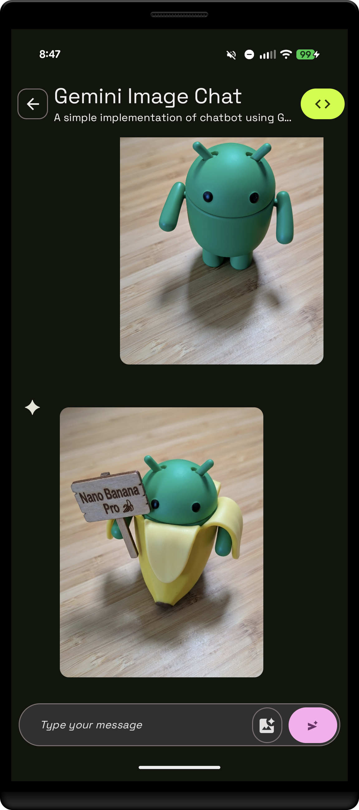

# Nanobanana Image Generation Sample

This sample is part of the [AI Sample Catalog](../../). To build and run this sample, you should clone the entire repository.

## Description

This sample demonstrates how to generate images from text prompts using the Gemini 3.1 Flash Image model (a.k.a. "Nano Banana"). Users can input a text description, and the generative model will create an image based on that prompt, showcasing the power of text-to-image generation with Gemini.

<div style="text-align: center;">

</div>

## How it works

The application uses the Firebase AI SDK (see [How to run](../../#how-to-run)) for Android to interact with Gemini. The core logic is in the [`NanobananaDataSource.kt`](./src/main/java/com/android/ai/samples/nanobanana/data/NanobananaDataSource.kt) file. A `generativeModel` is initialized with specific configurations. When a user provides a text prompt, it's passed to the `generateImage` method, which returns the generated image as a bitmap.

Here is the key snippet of code that calls the generative model from [`NanobananaDataSource.kt`](./src/main/java/com/android/ai/samples/nanobanana/data/NanobananaDataSource.kt):

```kotlin
suspend fun generateImage(prompt: String): Bitmap {
    val response = generativeModel.generateContent(prompt)
    return response.candidates.firstOrNull()?.content?.parts?.firstNotNullOfOrNull { it.asImageOrNull() }
        ?: throw Exception("No image generated")
}
```

Read more about [Gemini](https://developer.android.com/ai/gemini) in the Android Documentation.
