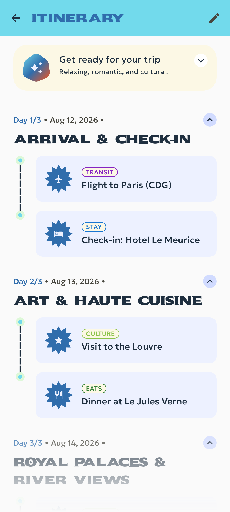
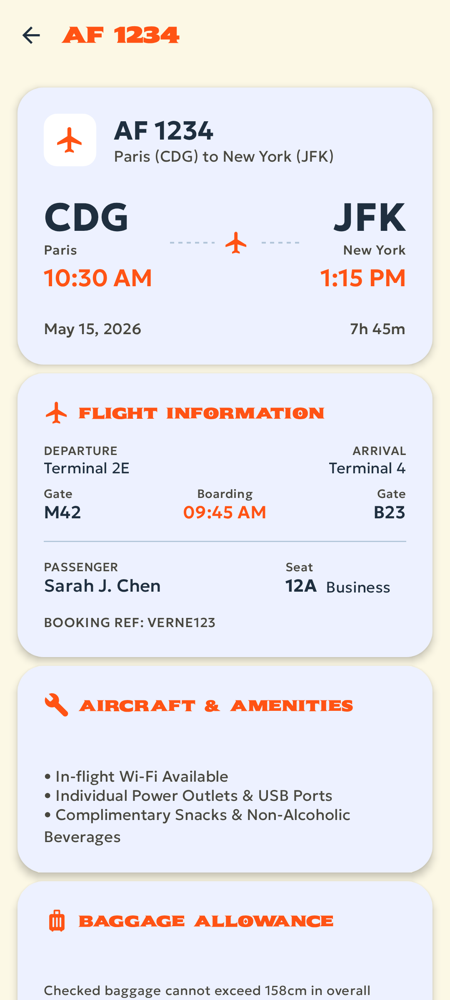

# JetPacker

<table align="center">
  <tr>
    <td align="center"><b>Home Screen</b></td>
    <td align="center"><b>Trip Itinerary</b></td>
    <td align="center"><b>Flight Detail</b></td>
  </tr>
  <tr>
    <td align="center"></td>
    <td align="center"></td>
    <td align="center"></td>
  </tr>
</table>

## Overview
JetPacker provides users with powerful tools to manage their upcoming trips and build out rich itineraries.

## Architecture
This project is built using modern Android architecture components:
- **UI**: Jetpack Compose
- **Dependency Injection**: Dagger/Hilt
- **Local Persistence**: Room Database
- **State Management**: ViewModels with StateFlow

## Module Overview
JetPacker follows a clean, multi-module Android structure organized by responsibility and domain:

### Core Modules (`:core:*`)
- **`:core:ui`**: Shared Jetpack Compose design system components (`JetPackerFab`, `JetPackerToolbar`, themes, custom typography).
- **`:core:flags`**: Centralized feature toggle system (`FeatureFlags`) controlling optional runtime capabilities.

### Data Modules (`:data:*`)
- **`:data:db`**: Room database configuration, entities, and local DAOs.
- **`:data:trips`**: Repository layer and data models managing high-level trip records.
- **`:data:itinerary`**: Repository layer and data models managing daily itinerary events (`TimelineEvent`, `EventType`).

### Feature Modules (`:feature:*`)
- **`:feature:home`**: Dashboard screen displaying the user's upcoming trips list.
- **`:feature:create_trip`**: Unified trip form module handling both new trip creation and existing trip editing (`EditTripScreen`).
- **`:feature:detail`**: Detailed view screens for specific itinerary events (Flights, Hotels, Restaurants, Museums, Tours).
- **`:feature:trip`**: Top-level trip container shell (`TripScreen`) holding navigation and orchestrating trip views.
  - **`:feature:trip:itinerary`**: Pure itinerary timeline screen displaying daily scheduled events.

## Getting Started

This project is built using the standard Android Gradle build system, allowing developers to quickly build, run, and experiment with the application locally using Android Studio.

### Configuration Setup

Before building or running the application, configure your local Android SDK path:

1. **Local Properties Setup**:
   - Navigate to the `android` directory and copy `local.properties.example` to `local.properties`:
     ```bash
     cd android
     cp local.properties.example local.properties
     ```
   - Update `sdk.dir` inside `local.properties` with your local Android SDK directory path.

### Building Using Gradle
To compile the application and run unit tests using Gradle, execute the following commands in your terminal (from the `android` directory):

```bash
# Navigate to the android directory
cd android

# Build a debug APK
./gradlew :app:assembleDebug

# Run unit tests
./gradlew test
```

## On-Device AI Features
JetPacker integrates pure on-device ML Kit capabilities.
These features run locally on the device and can be toggled or customized in `android/core/flags/src/main/java/com/example/jetpacker/core/flags/FeatureFlags.kt`:
- **ENABLE_AI_VIBE_CHECK**: Generates an on-device card summary of the current trip's vibe using ML Kit GenAI Prompt.
- **ENABLE_ITINERARY_ENRICHMENT**: Local enrichment for trip events.
- **ENABLE_EXPENSE_MANAGEMENT**: Local expense management tracking.
- **ENABLE_VOICE_NOTES**: On-device speech recognition and transcription for voice notes.

## IDE Setup & Development

To work on JetPacker locally, open the project in **Android Studio**:

1. Open Android Studio and select **Open an Existing Project** (or **File > Open**).
2. Select the `android` directory folder within the repository.
3. Android Studio will automatically sync Gradle and prepare the project.
